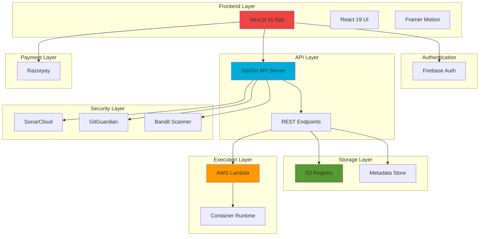
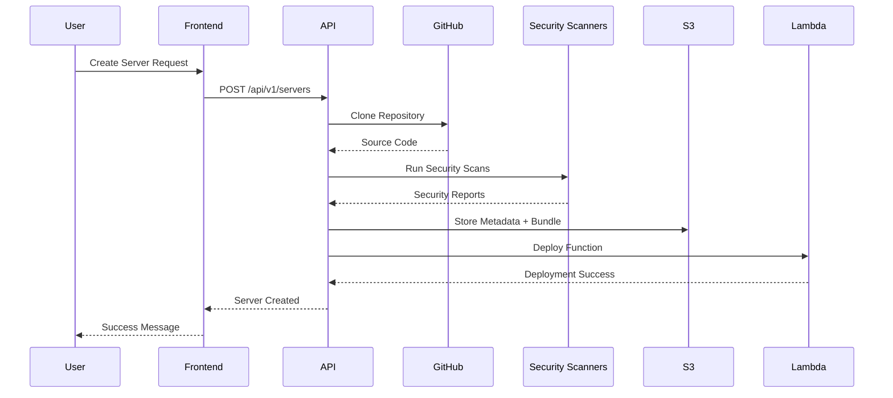
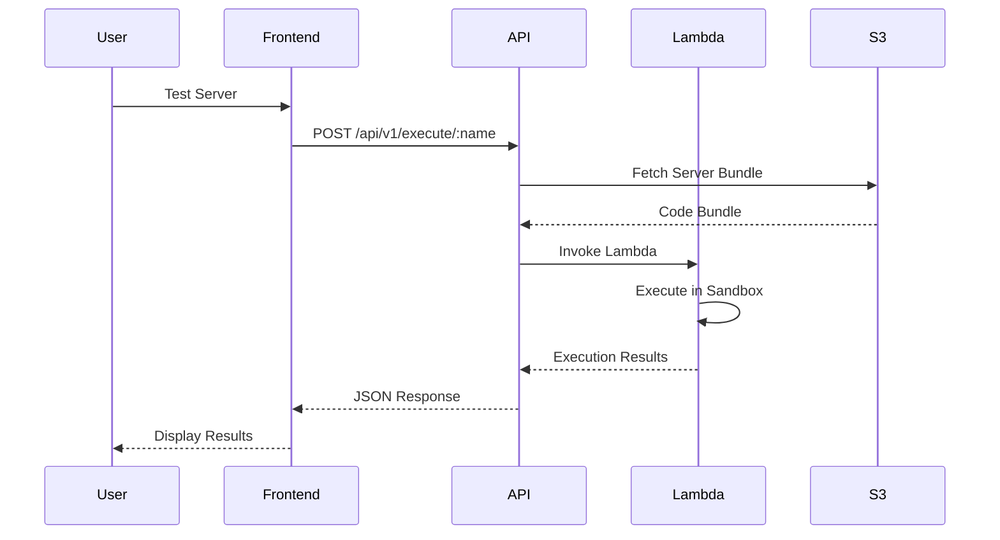
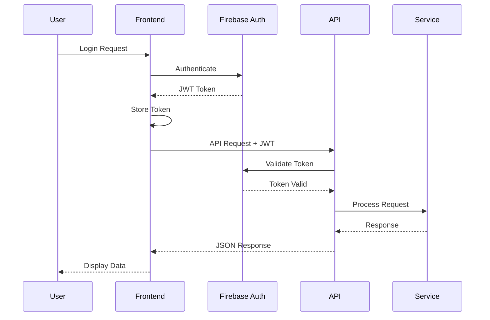

SuperBox is a cloud-native platform combining Next.js, Go, AWS Lambda, and S3 for scalable MCP server management.



## Component Architecture

### Frontend (Next.js 16)

The frontend is built with Next.js 16 and React 19, providing a modern, performant user interface with server-side rendering and optimal loading times.

<AccordionGroup>
  <Accordion icon="react" title="Core Technologies">
    - **Next.js 16**: App Router with Server Components
    - **React 19**: Latest features including Actions and improved Suspense
    - **TypeScript**: Type-safe development
    - **Tailwind CSS 4**: Utility-first styling with JIT compilation
    - **Framer Motion**: Smooth animations and transitions
  </Accordion>

<Accordion icon="folder-tree" title="Directory Structure">
  ``` src/ ├── app/ # Next.js App Router │ ├── layout.tsx # Root layout │ ├──
  page.tsx # Landing page │ ├── explore/ # Browse servers │ ├── server/[id]/ #
  Server details │ ├── playground/ # Test environment │ ├── my-servers/ # User's
  servers │ └── profile/ # User profile ├── components/ # Reusable components │
  ├── auth-modal.tsx │ ├── server-card.tsx │ ├── server-detail.tsx │ └── ... └──
  lib/ # Utilities └── types.ts # TypeScript definitions ```
</Accordion>

  <Accordion icon="puzzle-piece" title="Key Components">
    - **ServerCard**: Displays server information in grid/list views
    - **ServerDetail**: Full server information with tabs
    - **AuthModal**: Firebase authentication integration
    - **PublishModal**: Server publishing workflow
    - **PaywallModal**: Razorpay payment integration
    - **SecurityReport**: Visualizes security scan results
  </Accordion>
</AccordionGroup>

### Backend (Go + Gin)

The backend API is built with Go and the Gin web framework, providing high-performance REST endpoints with minimal latency.

<AccordionGroup>
  <Accordion icon="golang" title="API Server">
    ```go
    // Simplified architecture
    package main
    
    import (
        "github.com/gin-gonic/gin"
        "github.com/gin-contrib/cors"
    )
    
    func main() {
        router := gin.Default()
        router.Use(cors.Default())
        
        // API v1 routes
        v1 := router.Group("/api/v1")
        {
            v1.GET("/servers", listServers)
            v1.GET("/servers/:name", getServer)
            v1.POST("/servers", authMiddleware, createServer)
            v1.PUT("/servers/:name", authMiddleware, updateServer)
            v1.DELETE("/servers/:name", authMiddleware, deleteServer)
        }
        
        router.Run(":8080")
    }
    ```
  </Accordion>

<Accordion icon="layer-group" title="Middleware Stack">
  1. **CORS**: Cross-origin resource sharing 2. **Logger**: Request/response
  logging 3. **Recovery**: Panic recovery 4. **Auth**: Firebase token validation
  5. **Rate Limiter**: API rate limiting 6. **Compression**: Response
  compression
</Accordion>

  <Accordion icon="database" title="Data Flow">
    ```mermaid
    sequenceDiagram
        participant C as Client
        participant A as API Server
        participant F as Firebase
        participant S as S3
        participant L as Lambda
        
        C->>A: Request with JWT
        A->>F: Validate Token
        F-->>A: Token Valid
        A->>S: Fetch/Store Data
        S-->>A: Data Response
        A->>L: Trigger Execution
        L-->>A: Execution Result
        A-->>C: JSON Response
    ```
  </Accordion>
</AccordionGroup>

### Storage Layer (S3)

Amazon S3 serves as the registry backend, storing server metadata, code bundles, and security reports.

<CardGroup cols={2}>
  <Card title="Registry Structure" icon="folder">
    ```
    superbox-registry/
    ├── servers/
    │   ├── server-1.json
    │   ├── server-2.json
    │   └── ...
    ├── bundles/
    │   ├── server-1-v1.0.0.tar.gz
    │   └── ...
    └── reports/
        ├── server-1-security.json
        └── ...
    ```
  </Card>
  
  <Card title="Metadata Schema" icon="file-code">
    ```json
    {
      "name": "server-name",
      "version": "1.0.0",
      "description": "...",
      "author": "...",
      "lang": "python",
      "entrypoint": "main.py",
      "repository": {...},
      "pricing": {...},
      "security_report": {...}
    }
    ```
  </Card>
</CardGroup>

### Execution Layer (AWS Lambda)

MCP servers run in isolated AWS Lambda functions, providing secure sandboxed execution with automatic scaling.

<Accordion title="Lambda Architecture">
  **Container Image Approach:**
  
  1. Server code is packaged into a container image
  2. Image is stored in Amazon ECR (Elastic Container Registry)
  3. Lambda function uses the container image
  4. Each execution runs in an isolated environment
  
  **Key Features:**
  - 15-minute execution timeout
  - Up to 10GB memory allocation
  - Automatic scaling and load balancing
  - VPC isolation for enhanced security
  - CloudWatch logging and monitoring
  
  **Execution Flow:**
  ```mermaid
  graph LR
      A[API Request] --> B[Lambda Invoke]
      B --> C[Container Start]
      C --> D[Run MCP Server]
      D --> E[Capture Output]
      E --> F[Return Response]
      F --> G[Container Cleanup]
  ```
</Accordion>

### Security Layer

SuperBox implements a comprehensive security pipeline with multiple scanning tools.

<Steps>
  <Step title="SonarCloud Analysis">
    - Code quality metrics - Bug detection - Vulnerability scanning - Code smell
    identification - Maintainability rating
  </Step>

<Step title="GitGuardian Secrets Detection">
  - API key detection - Password scanning - Token identification - Certificate
  detection
</Step>

  <Step title="Bandit Security Audit (Python)">
    - Python-specific vulnerability detection - CWE (Common Weakness
    Enumeration) mapping - Severity and confidence ratings - Detailed issue
    reports
  </Step>
</Steps>

## Data Flow

### Server Creation Flow



### Server Execution Flow



## Authentication Flow

SuperBox uses Firebase Authentication with JWT token validation.



## Payment Integration

Razorpay handles all payment processing for paid MCP servers.

<AccordionGroup>
  <Accordion icon="credit-card" title="Payment Flow">
    1. User selects a paid server 2. Frontend creates Razorpay order 3. User
    completes payment 4. Webhook validates payment 5. Server access is granted
    6. Transaction recorded in database
  </Accordion>

  <Accordion icon="shield" title="Security Measures">
    - PCI-DSS compliant payment processing - Webhook signature verification -
    Idempotency keys for duplicate prevention - Encrypted payment data - Secure
    refund handling
  </Accordion>
</AccordionGroup>

## Scalability & Performance

<CardGroup cols={2}>
  <Card title="Frontend Optimization" icon="gauge-high">
    - Next.js ISR (Incremental Static Regeneration) - Image optimization with
    next/image - Code splitting and lazy loading - CDN distribution via Vercel -
    Aggressive caching strategies
  </Card>

<Card title="Backend Optimization" icon="bolt">
  - Go's concurrent processing - Connection pooling - Response caching - Gzip
  compression - Efficient JSON serialization
</Card>

<Card title="Storage Optimization" icon="database">
  - S3 intelligent tiering - CloudFront CDN - Transfer acceleration - Multipart
  uploads - Lifecycle policies
</Card>

  <Card title="Execution Optimization" icon="server">
    - Lambda provisioned concurrency - Container image caching - Warm start
    optimization - Auto-scaling policies - Cost optimization
  </Card>
</CardGroup>

## Monitoring & Observability

<Tabs>
  <Tab title="Logging">
    - **CloudWatch Logs**: Lambda execution logs - **API Logs**:
    Request/response logging - **Error Tracking**: Centralized error monitoring
    - **Audit Logs**: Security and compliance tracking
  </Tab>

<Tab title="Metrics">
  - **CloudWatch Metrics**: System health metrics - **Custom Metrics**: Business
  KPIs - **Performance Metrics**: Response times, throughput - **Cost Metrics**:
  Resource usage tracking
</Tab>

  <Tab title="Alerting">
    - **SNS Notifications**: Critical alerts - **Email Alerts**: Warning
    notifications - **Slack Integration**: Team notifications - **PagerDuty**:
    Incident management
  </Tab>
</Tabs>

## Infrastructure as Code

SuperBox infrastructure is managed with Infrastructure as Code principles.

```yaml
# Example AWS SAM template (simplified)
AWSTemplateFormatVersion: "2010-09-09"
Transform: AWS::Serverless-2016-10-31

Resources:
  ServerRegistry:
    Type: AWS::S3::Bucket
    Properties:
      BucketName: superbox-registry
      VersioningConfiguration:
        Status: Enabled

  MCPExecutionFunction:
    Type: AWS::Serverless::Function
    Properties:
      PackageType: Image
      MemorySize: 2048
      Timeout: 900
      Environment:
        Variables:
          REGISTRY_BUCKET: !Ref ServerRegistry
```

## Deployment Pipeline

<Steps>
  <Step title="Development">
    Local development with hot reload - Frontend: `npm run dev` - Backend: `go
    run main.go`
  </Step>

<Step title="Testing">
  Automated testing and validation - Unit tests - Integration tests - E2E tests
  with Playwright
</Step>

<Step title="Staging">
  Deploy to staging environment - Preview deployments on Vercel - Backend
  staging on AWS - Smoke tests
</Step>

  <Step title="Production">
    Production deployment - Blue-green deployment - Canary releases - Rollback
    capability - Health checks
  </Step>
</Steps>

<Info>
  This architecture is designed for high availability, security, and
  scalability, ensuring SuperBox can handle thousands of concurrent users and
  server executions.
</Info>
