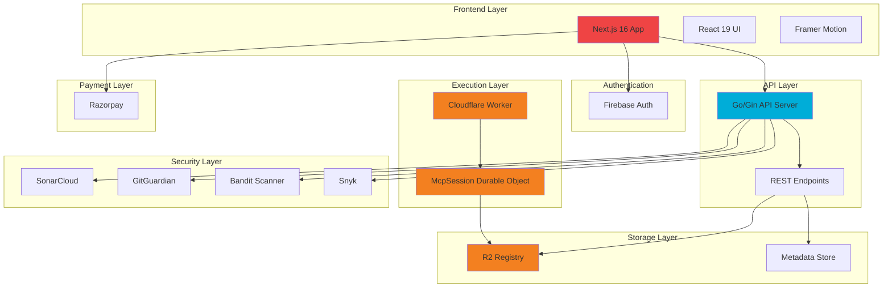
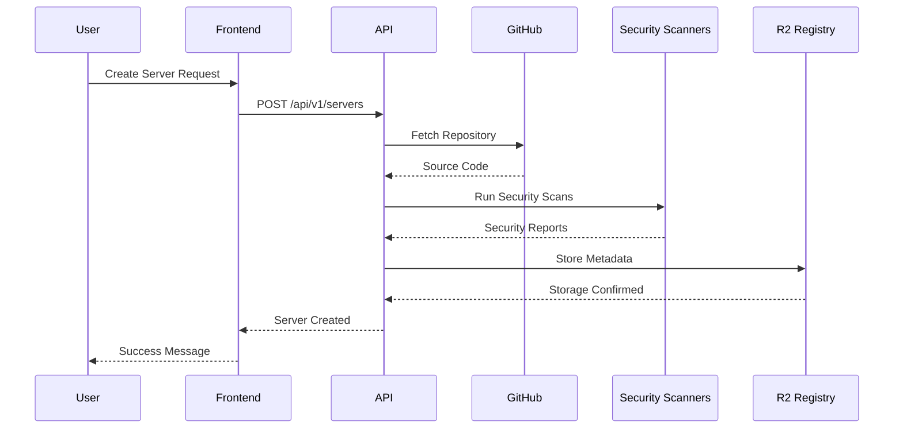
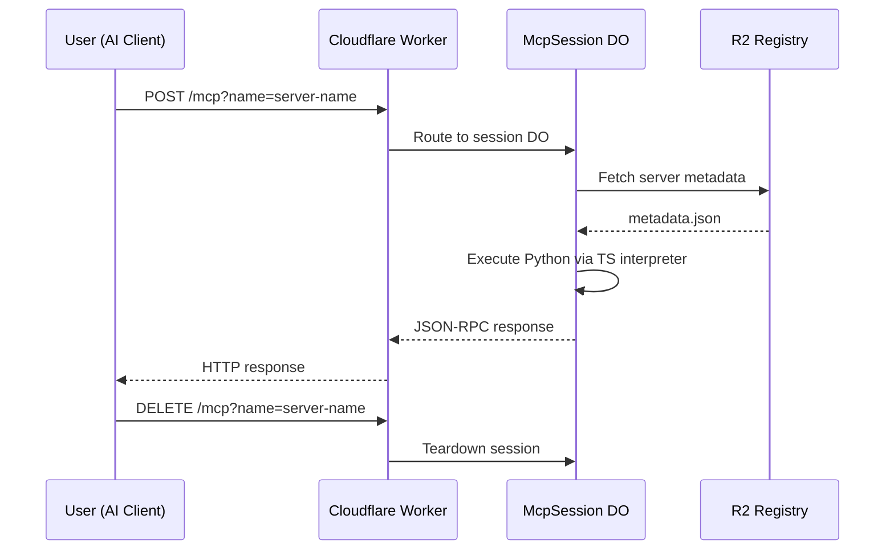
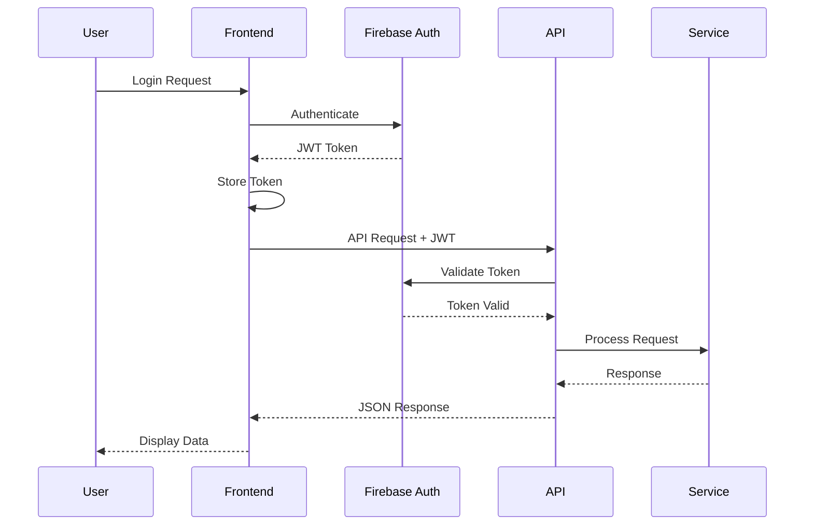

---
title: "Architecture"
description: "Deep dive into SuperBox system architecture and design"
icon: "diagram-project"
---

SuperBox is a cloud-native platform combining Next.js, Go, Cloudflare Workers, and Cloudflare R2 for scalable MCP server management.


```mermaid
graph TB
 subgraph "Frontend Layer"
  A[Next.js 16 App]
  B[React 19 UI]
  C[Framer Motion]
 end

 subgraph "Authentication"
  D[Firebase Auth]
 end

 subgraph "API Layer"
  E[Go/Gin API Server]
  F[REST Endpoints]
 end

 subgraph "Storage Layer"
  G[R2 Registry]
  H[Metadata Store]
 end

 subgraph "Execution Layer"
  I[Cloudflare Worker]
  J[McpSession Durable Object]
 end

 subgraph "Security Layer"
  K[SonarCloud]
  L[GitGuardian]
  M[Bandit Scanner]
  N[Snyk]
 end

 subgraph "Payment Layer"
  O[Razorpay]
 end

 A --> D
 A --> E
 E --> F
 F --> G
 F --> H
 I --> J
 J --> G
 E --> K
 E --> L
 E --> M
 E --> N
 A --> O

 style A fill:#ef4444
 style E fill:#00ADD8
 style I fill:#F38020
 style J fill:#F38020
 style G fill:#F38020
```

## Component Architecture

### Frontend (Next.js 16)

The frontend is built with Next.js 16 and React 19, providing a modern, performant user interface with server-side rendering and optimal loading times.

<AccordionGroup>
  <Accordion icon="react" title="Core Technologies">
 - **Next.js 16**: App Router with Server Components
 - **React 19**: Latest features including Actions and improved Suspense
 - **TypeScript**: Type-safe development
 - **Tailwind CSS 4**: Utility-first styling with JIT compilation
 - **Framer Motion**: Smooth animations and transitions
  </Accordion>

  <Accordion icon="puzzle-piece" title="Key Components">
 - **ServerCard**: Displays server information in grid/list views
 - **ServerDetail**: Full server information with tabs
 - **AuthModal**: Firebase authentication integration
 - **PublishModal**: Server publishing workflow
 - **PaywallModal**: Razorpay payment integration
 - **SecurityReport**: Visualizes security scan results
  </Accordion>
</AccordionGroup>

### Backend (Go + Gin)

The backend API is built with Go and the Gin web framework, providing high-performance REST endpoints with minimal latency.

<AccordionGroup>
  <Accordion icon="golang" title="API Server">
 ```go
 // Simplified architecture
 package main
 
 import (
  "github.com/gin-gonic/gin"
  "github.com/gin-contrib/cors"
 )
 
 func main() {
  router := gin.Default()
  router.Use(cors.Default())
  
  // API v1 routes
  v1 := router.Group("/api/v1")
  {
v1.GET("/servers", listServers)
v1.GET("/servers/:name", getServer)
v1.POST("/servers", authMiddleware, createServer)
v1.PUT("/servers/:name", authMiddleware, updateServer)
v1.DELETE("/servers/:name", authMiddleware, deleteServer)
  }
  
  router.Run(":8080")
 }
 ```
  </Accordion>

<Accordion icon="layer-group" title="Middleware Stack">
  1. **CORS**: Cross-origin resource sharing
  2. **Logger**: Request/response logging
  3. **Recovery**: Panic recovery
  4. **Auth**: Firebase token validation
  5. **Rate Limiter**: API rate limiting
  6. **Compression**: Response compression
</Accordion>

  <Accordion icon="database" title="Data Flow">
 ```mermaid
 sequenceDiagram
  participant C as Client
  participant A as API Server
  participant F as Firebase
  participant R as R2 Registry
  participant W as Cloudflare Worker
  
  C->>A: Request with JWT
  A->>F: Validate Token
  F-->>A: Token Valid
  A->>R: Fetch/Store Data
  R-->>A: Data Response
  A->>W: Trigger Execution
  W-->>A: Execution Result
  A-->>C: JSON Response
 ```
  </Accordion>
</AccordionGroup>

### Storage Layer (Cloudflare R2)

Cloudflare R2 serves as the registry backend, storing server metadata and security reports via an S3-compatible API.

<CardGroup cols={2}>
  <Card title="Registry Structure" icon="folder">
 ```
 superbox-mcp-registry/
 +-- {server-name}.json
 \-- ...
 ```
 Flat-file layout - one JSON object per server.
  </Card>
  
  <Card title="Metadata Schema" icon="file-code">
 ```json
 {
"name": "server-name",
"version": "1.0.0",
"description": "...",
"author": "...",
"lang": "python",
"entrypoint": "main.py",
"repository": {
  "type": "git",
  "url": "..."
},
"pricing": {
  "currency": "INR",
  "amount": 0.0
},
"security_report": {
  "status": "passed"
}
 }
 ```
  </Card>
</CardGroup>

### Execution Layer (Cloudflare Workers + Durable Objects)

MCP servers run inside `McpSession` Durable Objects - one per session, keyed on the `Mcp-Session-Id` header. Sessions auto-evict after 30 minutes of inactivity. No local proxy process is needed; AI clients connect directly via HTTP.

<Accordion title="Execution Architecture">
  **Streamable HTTP Approach (MCP rev 2025-11-25):**
  
  1. AI client sends `POST /mcp?name=<server>` to the Cloudflare Worker
  2. Worker routes the request to (or creates) the session's Durable Object
  3. DO fetches server metadata from R2 to locate the entrypoint
  4. The embedded TypeScript interpreter executes the Python entrypoint in-process
  5. JSON-RPC response streams back over HTTP
  6. `DELETE /mcp?name=<server>` tears down the session

  **What the TypeScript interpreter supports:**
  - `requests`-based HTTP calls
  - JSON parsing and serialisation
  - Common control flow and string manipulation

  **Not supported** (use separate services if needed):
  - `httpx`, `aiohttp`, `async def`
  - C extensions, binary wheels
  - Class definitions, file I/O
  
  **Execution Flow:**
  ```mermaid
  graph LR
A[AI Client] --> B[Cloudflare Worker]
B --> C[McpSession DO]
C --> D[Fetch Metadata from R2]
D --> E[TS Interpreter runs Python]
E --> F[Stream JSON-RPC Response]
F --> A
  ```
</Accordion>

### Security Layer

SuperBox implements a five-stage security pipeline before any server enters the registry.

<Steps>
  <Step title="SonarCloud Analysis">
 Code quality metrics, bug detection, vulnerability scanning, maintainability rating
  </Step>

  <Step title="Tool Discovery">
 Clones the repository and validates reported MCP tools exist via regex scan for `@*.tool()` decorators
  </Step>

  <Step title="Snyk Dependency Scan">
 Known CVE detection in Python dependencies
  </Step>

  <Step title="GitGuardian Secrets Detection">
 API key, password, token, and certificate detection
  </Step>

  <Step title="Bandit Security Audit">
 Python-specific vulnerability detection with CWE mapping
  </Step>
</Steps>

## Data Flow

### Server Creation Flow


```mermaid
sequenceDiagram
 participant U as User
 participant F as Frontend
 participant A as API
 participant G as GitHub
 participant SC as Security Scanners
 participant R as R2 Registry

 U->>F: Create Server Request
 F->>A: POST /api/v1/servers
 A->>G: Fetch Repository
 G-->>A: Source Code
 A->>SC: Run Security Scans
 SC-->>A: Security Reports
 A->>R: Store Metadata
 R-->>A: Storage Confirmed
 A-->>F: Server Created
 F-->>U: Success Message
```

### Server Execution Flow


```mermaid
sequenceDiagram
 participant U as User (AI Client)
 participant W as Cloudflare Worker
 participant DO as McpSession DO
 participant R as R2 Registry

 U->>W: POST /mcp?name=server-name
 W->>DO: Route to session DO
 DO->>R: Fetch server metadata
 R-->>DO: metadata.json
 DO->>DO: Execute Python via TS interpreter
 DO-->>W: JSON-RPC response
 W-->>U: HTTP response
 U->>W: DELETE /mcp?name=server-name
 W->>DO: Teardown session
```

## Authentication Flow

SuperBox uses Firebase Authentication with JWT token validation.


```mermaid
sequenceDiagram
 participant U as User
 participant F as Frontend
 participant FB as Firebase Auth
 participant A as API
 participant S as Service

 U->>F: Login Request
 F->>FB: Authenticate
 FB-->>F: JWT Token
 F->>F: Store Token
 F->>A: API Request + JWT
 A->>FB: Validate Token
 FB-->>A: Token Valid
 A->>S: Process Request
 S-->>A: Response
 A-->>F: JSON Response
 F-->>U: Display Data
```

## Payment Integration

Razorpay handles all payment processing for paid MCP servers.

<AccordionGroup>
  <Accordion icon="credit-card" title="Payment Flow">
 1. User selects a paid server 2. Frontend creates Razorpay order 3. User
 completes payment 4. Webhook validates payment 5. Server access is granted
 6. Transaction recorded in database
  </Accordion>

  <Accordion icon="shield" title="Security Measures">
 - PCI-DSS compliant payment processing - Webhook signature verification -
 Idempotency keys for duplicate prevention - Encrypted payment data - Secure
 refund handling
  </Accordion>
</AccordionGroup>
