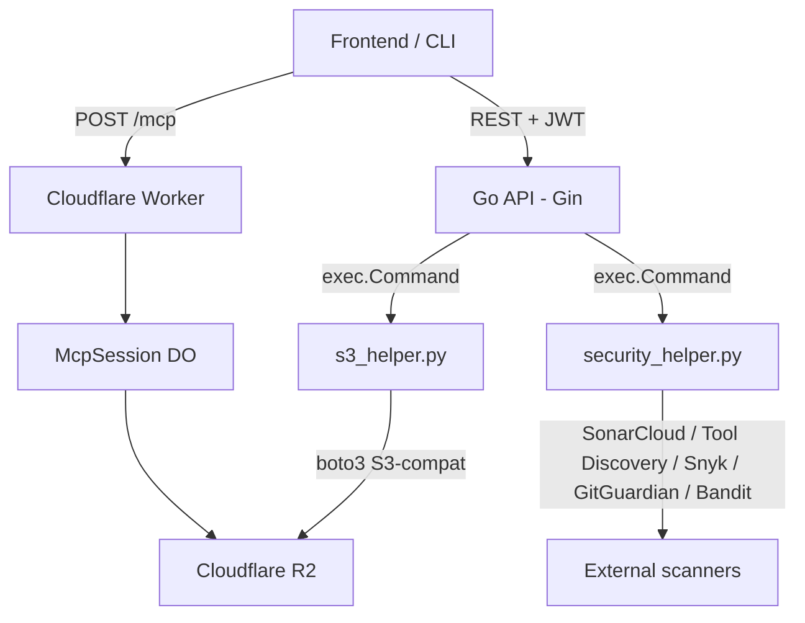
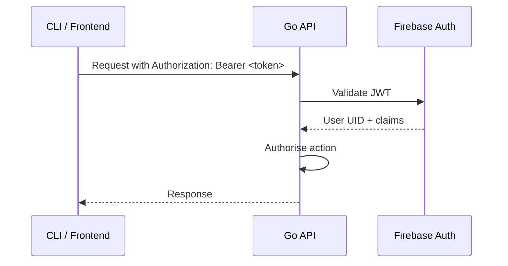
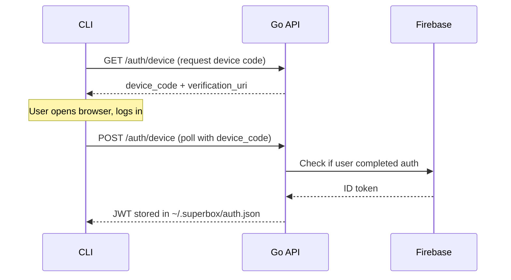

---
title: "Backend Architecture"
description: "Go API server, Python subprocess IPC, and Cloudflare R2 storage"
icon: "sitemap"
---

## System Overview

The SuperBox backend is composed of three runtime components that work together:

1. **Go API (Gin)** - handles all REST requests from the frontend and CLI; delegates storage and security work to Python subprocess helpers
2. **Python helpers** - `s3_helper.py` (R2 IPC bridge) and `security_helper.py` (5-stage scan runner), invoked by the Go API via `exec.Command`
3. **Cloudflare Worker + Durable Object** - stateless edge proxy + stateful session runtime for MCP execution



## Go API Layer

**Framework:** Gin (Go 1.26)  
**Auth:** Firebase JWT middleware on all write endpoints

### Route groups

```go
v1 := router.Group("/api/v1")
{
 v1.GET("/servers",listServers)
 v1.GET("/servers/:name", getServer)
 v1.POST("/servers",  authMiddleware, createServer)
 v1.PUT("/servers/:name",  authMiddleware, updateServer)
 v1.DELETE("/servers/:name", authMiddleware, deleteServer)
 v1.GET("/auth/device",  deviceAuthStart)
 v1.POST("/auth/device", deviceAuthPoll)
}
```

### Middleware stack

1. CORS
2. Logger (request / response)
3. Recovery (panic to 500)
4. Firebase auth (write endpoints)
5. Rate limiter

## Python Subprocess Helpers

The Go API delegates R2 operations to Python subprocesses (via boto3), since the Go S3-compat SDK does not fully support Cloudflare R2 quirks.

### s3_helper.py

Handles all R2 operations: `get_object`, `put_object`, `delete_object`, `list_objects`.

```python
# Called by Go as:
# python s3_helper.py get <bucket> <key>
# python s3_helper.py put <bucket> <key> <json-body>
```

Environment variables consumed: `CLOUDFLARE_R2_ENDPOINT`, `CLOUDFLARE_R2_ACCESS_KEY_ID`, `CLOUDFLARE_R2_SECRET_ACCESS_KEY`, `CLOUDFLARE_R2_BUCKET_NAME`.

### security_helper.py

Runs the 5-stage security pipeline on a given repository URL:

1. SonarCloud analysis
2. Tool discovery (clone repo, regex scan for `@*.tool()` decorators)
3. Snyk dependency scan
4. GitGuardian secret detection
5. Bandit Python scan

Returns a structured JSON security report that the Go API stores alongside server metadata.

## Data Models

### Server metadata (stored in R2 as `{server-name}.json`)

```json
{
  "name": "weather-server",
  "version": "1.0.0",
  "description": "Get current weather for any city",
  "author": "user@example.com",
  "lang": "python",
  "entrypoint": "main.py",
  "repository": {
 "type": "git",
 "url": "https://github.com/user/weather-server"
  },
  "tools": [
 { "name": "get_weather", "description": "Fetch weather data for a city" }
  ],
  "pricing": { "currency": "INR", "amount": 0.0 },
  "security_report": {
 "status": "passed",
 "sonarcloud": { "bugs": 0, "vulnerabilities": 0 },
 "snyk": { "critical": 0, "high": 0 },
 "gitguardian": { "secrets_found": 0 },
 "bandit": { "high": 0, "medium": 0 }
  }
}
```

## Authentication Flow



Device flow (for CLI `superbox auth login`):

