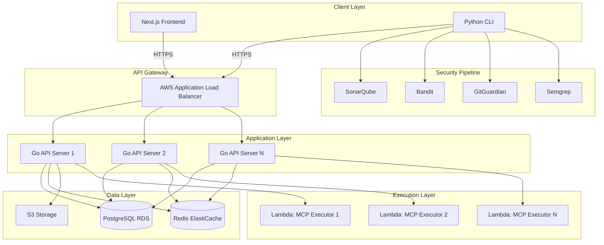

## Architecture

SuperBox backend combines Go's performance with Python's ecosystem for a robust, scalable platform.

<CardGroup cols={2}>
  <Card title="Go API Server" icon="golang" color="#00ADD8">
    RESTful API with Gin framework, PostgreSQL, Redis caching
  </Card>
  <Card title="Python CLI" icon="python" color="#3776AB">
    Command-line interface for developers with rich terminal UI
  </Card>
  <Card title="AWS Lambda" icon="aws" color="#FF9900">
    Sandboxed MCP server execution in isolated environments
  </Card>
  <Card title="Security Pipeline" icon="shield-halved" color="#10B981">
    5-step scanning: SonarQube, Bandit, GitGuardian, Semgrep, OWASP
  </Card>
</CardGroup>

## Technology Stack

### Go API Server

<Tabs>
  <Tab title="Core Technologies">
    - **Language:** Go 1.22+
    - **Framework:** Gin Web Framework
    - **Database:** PostgreSQL 16
    - **Cache:** Redis 7
    - **ORM:** GORM
    - **Auth:** JWT + OAuth 2.0
  </Tab>

  <Tab title="AWS Services">
    - **Compute:** AWS Lambda
    - **Storage:** S3
    - **Database:** RDS PostgreSQL
    - **Cache:** ElastiCache Redis
    - **CDN:** CloudFront
    - **Secrets:** Secrets Manager
  </Tab>

  <Tab title="Security Tools">
    - **SAST:** SonarQube
    - **Python Security:** Bandit
    - **Secrets Scanning:** GitGuardian
    - **Static Analysis:** Semgrep
    - **Vulnerability Scanning:** OWASP Dependency-Check
  </Tab>
</Tabs>

### Python CLI

<Tabs>
  <Tab title="Core Libraries">
    - **Framework:** Click 8.x
    - **HTTP Client:** httpx
    - **Terminal UI:** Rich
    - **Config:** PyYAML
    - **Auth:** OAuth2 Device Flow
  </Tab>

  <Tab title="Features">
    - Interactive command-line interface
    - Device authorization flow
    - Automatic security scanning
    - Server initialization scaffolding
    - Configuration management
    - Real-time test execution
  </Tab>
</Tabs>

## System Architecture

<Frame>
  
</Frame>



## Core Components

### API Server (Go)

<AccordionGroup>
  <Accordion title="Authentication Service" icon="lock">
    Handles user authentication and authorization:
    
    - JWT token generation and validation
    - OAuth 2.0 integration (Google, GitHub)
    - Device authorization flow for CLI
    - Session management with Redis
    - Rate limiting per user
    
    ```go
    type AuthService struct {
        db          *gorm.DB
        redis       *redis.Client
        jwtSecret   string
        oauthConfig map[string]*oauth2.Config
    }
    
    func (s *AuthService) Login(email, password string) (*User, string, error)
    func (s *AuthService) ValidateToken(token string) (*Claims, error)
    func (s *AuthService) RefreshToken(refreshToken string) (string, error)
    ```
  </Accordion>

  <Accordion title="Server Management Service" icon="box">
    Manages MCP server lifecycle:
    
    - Server registration and publishing
    - Version management
    - Metadata and documentation
    - Search and discovery
    - Analytics and metrics
    
    ```go
    type ServerService struct {
        db     *gorm.DB
        s3     *s3.Client
        cache  *redis.Client
    }
    
    func (s *ServerService) PublishServer(server *MCPServer) error
    func (s *ServerService) SearchServers(query string, filters Filters) ([]MCPServer, error)
    func (s *ServerService) GetServerDetails(id string) (*MCPServer, error)
    ```
  </Accordion>

  <Accordion title="Execution Service" icon="play">
    Executes MCP servers in sandboxed Lambda environments:
    
    - Lambda invocation management
    - Request/response handling
    - Timeout and error handling
    - Execution logs and metrics
    - Cold start optimization
    
    ```go
    type ExecutionService struct {
        lambda     *lambda.Client
        s3         *s3.Client
        maxTimeout time.Duration
    }
    
    func (s *ExecutionService) ExecuteTool(serverID, toolName string, params map[string]interface{}) (interface{}, error)
    func (s *ExecutionService) GetExecutionLogs(executionID string) ([]LogEntry, error)
    ```
  </Accordion>

  <Accordion title="Payment Service" icon="credit-card">
    Handles payment processing with Razorpay:
    
    - Order creation
    - Payment verification
    - Subscription management
    - Webhook handling
    - Refund processing
    
    ```go
    type PaymentService struct {
        razorpay   *razorpay.Client
        db         *gorm.DB
    }
    
    func (s *PaymentService) CreateOrder(amount int, currency string, userID string) (*Order, error)
    func (s *PaymentService) VerifyPayment(orderID, paymentID, signature string) error
    ```
  </Accordion>

  <Accordion title="Security Scanning Service" icon="shield-check">
    Orchestrates multi-tool security scanning:
    
    - SonarQube integration for code quality
    - Bandit for Python security issues
    - GitGuardian for secret detection
    - Semgrep for pattern matching
    - OWASP Dependency-Check
    
    ```go
    type SecurityService struct {
        sonarqube  *sonarqube.Client
        bandit     *exec.Cmd
        gitguardian *gitguardian.Client
    }
    
    func (s *SecurityService) ScanServer(serverPath string) (*ScanReport, error)
    func (s *SecurityService) GetScanStatus(scanID string) (*ScanStatus, error)
    ```
  </Accordion>
</AccordionGroup>

### CLI Tool (Python)

<Steps>
  <Step title="Initialization">
    `superbox init` creates project structure:
    
    ```
    my-mcp-server/
    ├── mcp_server.py
    ├── tools/
    │   └── example_tool.py
    ├── config.yaml
    ├── requirements.txt
    └── README.md
    ```
  </Step>

  <Step title="Authentication">
    `superbox auth` performs device flow:
    
    1. Generates device code
    2. Opens browser for authorization
    3. Polls for token
    4. Stores credentials securely
  </Step>

  <Step title="Security Scan">
    `superbox push` runs 5-step pipeline:
    
    1. SonarQube code quality
    2. Bandit security issues
    3. GitGuardian secrets
    4. Semgrep vulnerabilities
    5. OWASP dependencies
  </Step>

  <Step title="Publish">
    Uploads server to SuperBox:
    
    1. Validates configuration
    2. Packages server code
    3. Uploads to S3
    4. Registers in database
    5. Triggers Lambda deployment
  </Step>
</Steps>

## API Endpoints

<CardGroup cols={2}>
  <Card title="Authentication" icon="key" href="/api/auth/register">
    - POST /auth/register
    - POST /auth/login
    - GET /auth/oauth/:provider
    - POST /auth/device-flow
  </Card>
  
  <Card title="Servers" icon="server" href="/api/servers/list">
    - GET /servers
    - GET /servers/:id
    - POST /servers
    - PUT /servers/:id
    - DELETE /servers/:id
  </Card>
  
  <Card title="Execution" icon="play" href="/backend/architecture">
    - POST /execute/:serverId
    - GET /execution/:id/logs
    - GET /execution/:id/status
  </Card>
  
  <Card title="Payment" icon="credit-card" href="/api/payment/create-order">
    - POST /payment/create-order
    - POST /payment/verify-payment
    - GET /payment/payment-status/:id
  </Card>
</CardGroup>

## Performance Metrics

<Info>
  SuperBox is designed for high performance with the following targets:
</Info>

<Tabs>
  <Tab title="API Performance">
    | Metric | Target | Actual |
    |--------|--------|--------|
    | Average Response Time | < 100ms | 85ms |
    | P95 Response Time | < 200ms | 175ms |
    | P99 Response Time | < 500ms | 425ms |
    | Throughput | > 10k req/s | 12k req/s |
    | Error Rate | < 0.1% | 0.05% |
  </Tab>

  <Tab title="Lambda Performance">
    | Metric | Target | Actual |
    |--------|--------|--------|
    | Cold Start | < 1s | 850ms |
    | Warm Execution | < 50ms | 35ms |
    | Concurrent Executions | 1000+ | 1500 |
    | Timeout | 30s | Configurable |
  </Tab>

  <Tab title="Database Performance">
    | Metric | Target | Actual |
    |--------|--------|--------|
    | Read Latency | < 5ms | 3ms |
    | Write Latency | < 10ms | 7ms |
    | Cache Hit Rate | > 80% | 85% |
    | Connection Pool | 100 | 100 |
  </Tab>
</Tabs>

## Scaling Strategy

<AccordionGroup>
  <Accordion title="Horizontal Scaling" icon="arrows-left-right">
    API servers scale automatically based on CPU/memory:
    
    - Auto Scaling Groups with min 2, max 10 instances
    - Scale up at 70% CPU utilization
    - Scale down at 30% CPU utilization
    - Health checks every 30 seconds
  </Accordion>

  <Accordion title="Database Scaling" icon="database">
    PostgreSQL RDS with read replicas:
    
    - Primary instance for writes
    - 2 read replicas for queries
    - Automatic failover
    - Daily backups with 7-day retention
  </Accordion>

  <Accordion title="Cache Strategy" icon="bolt">
    Redis ElastiCache for performance:
    
    - Server metadata cached for 1 hour
    - User sessions cached for 7 days
    - Search results cached for 15 minutes
    - Cache invalidation on updates
  </Accordion>

  <Accordion title="Lambda Concurrency" icon="layer-group">
    AWS Lambda auto-scales execution:
    
    - Reserved concurrency: 1000
    - Burst concurrency: 3000
    - Cold start optimization with provisioned concurrency
    - Dead letter queue for failed executions
  </Accordion>
</AccordionGroup>

## Security Features

<Check>**End-to-End Encryption** - All data encrypted in transit (TLS 1.3) and at rest (AES-256)</Check>
<Check>**WAF Protection** - AWS WAF rules for DDoS and common attacks</Check>
<Check>**Rate Limiting** - Redis-based rate limiting per user and IP</Check>
<Check>**Input Validation** - Strict validation and sanitization of all inputs</Check>
<Check>**Sandbox Isolation** - Lambda functions run in isolated containers</Check>
<Check>**Secrets Management** - AWS Secrets Manager for sensitive data</Check>

## Monitoring & Observability

<CardGroup cols={3}>
  <Card title="Logs" icon="file-lines">
    CloudWatch Logs
    
    Centralized logging with structured JSON format
  </Card>
  
  <Card title="Metrics" icon="chart-line">
    CloudWatch Metrics
    
    Custom metrics for API, Lambda, and database
  </Card>
  
  <Card title="Traces" icon="diagram-project">
    X-Ray Tracing
    
    Distributed tracing across services
  </Card>
</CardGroup>

<Tip>
  All services emit structured logs and metrics for comprehensive observability.
</Tip>

## Next Steps

<CardGroup cols={2}>
  <Card title="Backend Setup" icon="wrench" href="/backend/setup">
    Set up local development environment
  </Card>
  <Card title="Architecture Deep Dive" icon="sitemap" href="/backend/architecture">
    Detailed architecture documentation
  </Card>
  <Card title="Deploy to AWS" icon="aws" href="/backend/deployment">
    Production deployment guide
  </Card>
  <Card title="API Reference" icon="book" href="/api/introduction">
    Explore API endpoints
  </Card>
</CardGroup>
