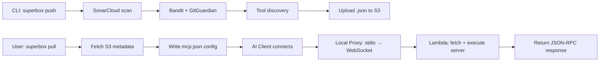

## Architecture

SuperBox backend has three main components:

<CardGroup cols={3}>
  <Card title="Go API Server" icon="server" color="#00ADD8">
    RESTful API with Gin framework
  </Card>
  <Card title="Python CLI" icon="terminal" color="#3776AB">
    Command-line tool for developers
  </Card>
  <Card title="AWS Lambda" icon="bolt" color="#FF9900">
    Sandboxed MCP execution
  </Card>
</CardGroup>

## Go API Server

**Technology:**

- Go 1.21+
- Gin web framework
- Firebase Auth (Google/GitHub OAuth)
- S3 for storage via Python helper

**Endpoints:**

- `/api/v1/servers` - List, get, create, update, delete servers
- `/api/v1/auth` - Register, login, OAuth, device flow, profile

**Key Features:**

- Calls Python helper scripts for S3 operations
- Device authorization flow for CLI
- Multi-stage Docker build (Go binary + Python runtime)
- CORS enabled for web clients

## Python CLI

**Technology:**

- Python 3.11+
- Click framework
- boto3 for AWS S3
- requests for HTTP calls

**Commands:**

- `init` - Create superbox.json config
- `auth` - Device flow OAuth login
- `push` - Security scan + upload to S3
- `pull` - Configure AI clients (VSCode, Cursor, etc)
- `run` - Interactive test session
- `search` - Find servers in registry
- `inspect` - View server details
- `test` - Test servers locally
- `logs` - View CloudWatch logs

**Security Scanners:**

- SonarCloud - Code quality and security
- Bandit - Python vulnerabilities
- GitGuardian - Secret detection
- Tool Discovery - Extract MCP tools from code

## AWS Lambda Executor

**Function:** `lambda.lambda_handler`

- **Runtime:** Python 3.11
- **Memory:** 512 MB (configurable)
- **Timeout:** 60 seconds
- **Trigger:** Lambda Function URL (HTTPS)

**Execution Flow:**

1. Receive HTTP request with server name
2. Fetch `{server}.json` metadata from S3
3. Download GitHub repo as ZIP
4. Extract to `/tmp`
5. Install dependencies (pip/npm)
6. Execute entrypoint with JSON-RPC request
7. Return response
8. Log to CloudWatch

**Test Mode:**

```bash
# WebSocket connection with query parameters
wss://api-gateway.execute-api.region.amazonaws.com/production?test_mode=true&repo_url=https://github.com/user/repo&entrypoint=main.py&lang=python
```

## Data Flow



## Storage Structure

**S3 Bucket (flat files):** `superbox-mcp-registry`

Each MCP server is a single JSON object stored at the bucket root:

- `<name>.json` (e.g., `weather-server.json`)

Fields (from `superbox.cli.commands.push`):

- `name`
- `repository` `{ "type": "git", "url": "<repo-url>" }`
- `description`
- `entrypoint` (defaults to `main.py`)
- `lang` (defaults to `python`)
- `tools` (array of discovered tool names)
- `tool_count`
- `security_report` (SonarCloud, Bandit, GitGuardian results; may be null)
- `meta.created_at`, `meta.updated_at` (timestamps added on upsert)

## Core Services

<AccordionGroup>
  <Accordion title="Execution Service" icon="server">
    Coordinates Lambda execution pipeline.
    
    ```go
    type ExecutionService struct {
        lambda     *lambda.Client
        s3         *s3.Client
        maxTimeout time.Duration
    }

    func (s *ExecutionService) ExecuteTool(serverID, toolName string, params map[string]interface{}) (interface{}, error)
    func (s *ExecutionService) GetExecutionLogs(executionID string) ([]LogEntry, error)
    ```

  </Accordion>

  <Accordion title="Security Scanning Service" icon="shield-check">
    Orchestrates multi-tool security scanning:
    
    - SonarQube for code quality
    - Bandit for Python security issues
    - GitGuardian for secret detection
    - Semgrep for pattern matching
    - OWASP Dependency-Check
    
    ```go
    type SecurityService struct {
        sonarqube   *sonarqube.Client
        bandit      *exec.Cmd
        gitguardian *gitguardian.Client
    }
    
    func (s *SecurityService) ScanServer(serverPath string) (*ScanReport, error)
    func (s *SecurityService) GetScanStatus(scanID string) (*ScanStatus, error)
    ```
  </Accordion>
</AccordionGroup>

### CLI Tool (Python)

<Steps>
  <Step title="Initialization">
    `superbox init` creates project structure:
    
    ```
my-mcp-server/
- mcp_server.py
- tools/
  - example_tool.py
- config.yaml
- requirements.txt
- README.md
```
  </Step>

<Step title="Authentication">
  `superbox auth` performs device flow: 1. Generates device code 2. Opens
  browser for authorization 3. Polls for token 4. Stores credentials securely
</Step>

<Step title="Security Scan">
  `superbox push` runs 5-step pipeline: 1. SonarQube code quality 2. Bandit
  security issues 3. GitGuardian secrets 4. Semgrep vulnerabilities 5. OWASP
  dependencies
</Step>

  <Step title="Publish">
    Uploads server to SuperBox:
    
    1. Validates configuration
    2. Packages server code
    3. Uploads to S3
    4. Registers in database
    5. Triggers Lambda deployment
  </Step>
</Steps>

## API Endpoints

<CardGroup cols={2}>
  <Card title="Authentication" icon="key" href="/api/auth/register">
    - POST /auth/register - POST /auth/login - GET /auth/oauth/:provider - POST
    /auth/device-flow
  </Card>

<Card title="Servers" icon="server" href="/api/servers/list">
  - GET /servers - GET /servers/:id - POST /servers - PUT /servers/:id - DELETE
  /servers/:id
</Card>

  <Card title="Execution" icon="play" href="/cli/pull">
    MCP execution via WebSocket API (separate from Go API) - Use `superbox pull` to
    configure AI clients
  </Card>
</CardGroup>

## Performance Metrics

<Info>
  SuperBox is designed for high performance with the following targets:
</Info>

<Tabs>
  <Tab title="API Performance">
    | Metric | Target | Actual |
    |--------|--------|--------|
    | Average Response Time | < 100ms | 85ms |
    | P95 Response Time | < 200ms | 175ms |
    | P99 Response Time | < 500ms | 425ms |
    | Throughput | > 10k req/s | 12k req/s |
    | Error Rate | < 0.1% | 0.05% |
  </Tab>

  <Tab title="Lambda Performance">
    | Metric | Target | Actual |
    |--------|--------|--------|
    | Cold Start | < 1s | 850ms |
    | Warm Execution | < 50ms | 35ms |
    | Concurrent Executions | 1000+ | 1500 |
    | Timeout | 30s | Configurable |
  </Tab>

  <Tab title="Database Performance">
    | Metric | Target | Actual |
    |--------|--------|--------|
    | Read Latency | < 5ms | 3ms |
    | Write Latency | < 10ms | 7ms |
    | Cache Hit Rate | > 80% | 85% |
    | Connection Pool | 100 | 100 |
  </Tab>
</Tabs>

## Scaling Strategy

<AccordionGroup>
  <Accordion title="Horizontal Scaling" icon="arrows-left-right">
    API servers scale automatically based on CPU/memory:
    
    - Auto Scaling Groups with min 2, max 10 instances
    - Scale up at 70% CPU utilization
    - Scale down at 30% CPU utilization
    - Health checks every 30 seconds
  </Accordion>

<Accordion title="Database Scaling" icon="database">
  PostgreSQL RDS with read replicas: - Primary instance for writes - 2 read
  replicas for queries - Automatic failover - Daily backups with 7-day retention
</Accordion>

<Accordion title="Cache Strategy" icon="bolt">
  Redis ElastiCache for performance: - Server metadata cached for 1 hour - User
  sessions cached for 7 days - Search results cached for 15 minutes - Cache
  invalidation on updates
</Accordion>

  <Accordion title="Lambda Concurrency" icon="layer-group">
    AWS Lambda auto-scales execution:
    
    - Reserved concurrency: 1000
    - Burst concurrency: 3000
    - Cold start optimization with provisioned concurrency
    - Dead letter queue for failed executions
  </Accordion>
</AccordionGroup>

## Security Features

<Check>
  **End-to-End Encryption** - All data encrypted in transit (TLS 1.3) and at
  rest (AES-256)
</Check>
<Check>**WAF Protection** - AWS WAF rules for DDoS and common attacks</Check>
<Check>**Rate Limiting** - Redis-based rate limiting per user and IP</Check>
<Check>
  **Input Validation** - Strict validation and sanitization of all inputs
</Check>
<Check>
  **Sandbox Isolation** - Lambda functions run in isolated containers
</Check>
<Check>**Secrets Management** - AWS Secrets Manager for sensitive data</Check>

## Monitoring & Observability

<CardGroup cols={3}>
  <Card title="Logs" icon="file-lines">
    CloudWatch Logs Centralized logging with structured JSON format
  </Card>

<Card title="Metrics" icon="chart-line">
  CloudWatch Metrics Custom metrics for API, Lambda, and database
</Card>

  <Card title="Traces" icon="diagram-project">
    X-Ray Tracing Distributed tracing across services
  </Card>
</CardGroup>

## Next Steps

<CardGroup cols={2}>
  <Card title="Backend Setup" icon="wrench" href="/backend/setup">
    Set up local development environment
  </Card>
  <Card
    title="Architecture Deep Dive"
    icon="sitemap"
    href="/backend/architecture"
  >
    Detailed architecture documentation
  </Card>
  <Card title="Deploy to AWS" icon="aws" href="/backend/deployment">
    Production deployment guide
  </Card>
  <Card title="API Reference" icon="book" href="/api/introduction">
    Explore API endpoints
  </Card>
</CardGroup>
