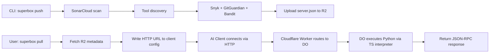

---
title: "Backend Overview"
description: "Go API server, Python CLI, and Cloudflare Workers execution"
icon: "server"
---

## Architecture

SuperBox backend has three main components:

<CardGroup cols={3}>
  <Card title="Go API Server" icon="server" color="#00ADD8">
 RESTful API with Gin framework
  </Card>
  <Card title="Python CLI" icon="terminal" color="#3776AB">
 Command-line tool for developers
  </Card>
  <Card title="Cloudflare Worker" icon="bolt" color="#F38020">
 Sandboxed MCP execution via Durable Objects
  </Card>
</CardGroup>

## Go API Server

**Technology:**

- Go 1.26
- Gin web framework
- Firebase Auth (Google/GitHub OAuth)
- Cloudflare R2 for storage via Python helper

**Endpoints:**

- `/api/v1/servers` - List, get, create, update, delete servers
- `/api/v1/auth` - Register, login, OAuth, device flow, profile

**Key Features:**

- Calls Python helper scripts for S3 operations
- Device authorization flow for CLI
- Multi-stage Docker build (Go binary + Python runtime)
- CORS enabled for web clients

## Python CLI

**Technology:**

- Python 3.11+
- Click framework
- boto3 for Cloudflare R2
- requests for HTTP calls

**Commands:**

- `init` - Create superbox.json config
- `auth` - Device flow OAuth login
- `push` - Security scan + upload to R2 registry
- `pull` - Configure AI clients (VSCode, Cursor, etc)
- `run` - **Deprecated** - prints a migration message and exits (use `superbox pull` instead)
- `search` - Find servers in registry
- `inspect` - View server details
- `test` - Test servers in test mode (skip R2 registry lookup)
- `logs` - Print `wrangler tail` instructions for viewing live Worker logs

**Security Scanners:**

- SonarCloud - Code quality and security
- Tool Discovery - Extract MCP tools from code
- Snyk - Dependency vulnerabilities
- GitGuardian - Secret detection
- Bandit - Python vulnerabilities

## Cloudflare Worker Executor

**Worker:** `superbox-executor`

- **URL:** `https://superbox-executor.<your-subdomain>.workers.dev/mcp`
- **Session runtime:** `McpSession` Durable Object
- **Protocol:** MCP Streamable HTTP (POST/DELETE)
- **Auth:** Firebase JWT

**Execution Flow:**

1. AI client sends `POST /mcp?name=<server>` with a `Mcp-Session-Id` header
2. Worker routes to (or creates) the `McpSession` Durable Object for that session
3. DO fetches `{server}.json` metadata from R2
4. Embedded TypeScript interpreter executes the Python entrypoint
5. JSON-RPC response streams back to the AI client
6. `DELETE /mcp?name=<server>` destroys the session

**Test Mode:**

```bash
POST /mcp?name=my-server&test_mode=true&repo_url=https://github.com/user/repo&entrypoint=main.py
```

## Data Flow


```mermaid
graph LR
 A["CLI: superbox push"] --> B["SonarCloud scan"]
 B --> C["Tool discovery"]
 C --> D["Snyk + GitGuardian + Bandit"]
 D --> E["Upload server.json to R2"]

 F["User: superbox pull"] --> G["Fetch R2 metadata"]
 G --> H["Write HTTP URL to client config"]
 H --> I["AI Client connects via HTTP"]
 I --> J["Cloudflare Worker routes to DO"]
 J --> K["DO executes Python via TS interpreter"]
 K --> L["Return JSON-RPC response"]
```

## Storage Structure

**R2 Bucket (flat files):** `superbox-mcp-registry`

Each MCP server is a single JSON object stored at the bucket root:

- `<name>.json` (e.g., `weather-server.json`)

Fields (from `superbox.cli.commands.push`):

- `name`
- `repository` `{ "type": "git", "url": "<repo-url>" }`
- `description`
- `entrypoint` (defaults to `main.py`)
- `lang` (defaults to `python`)
- `tools` `{ "count": <int>, "names": ["..."] }`
- `security_report` (SonarCloud, Bandit, GitGuardian results; may be null)
- `meta.created_at`, `meta.updated_at` (timestamps added on upsert)
