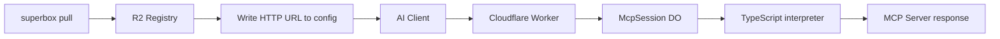

---
title: "superbox pull"
description: "Configure AI client to use an MCP server from the registry"
icon: "cloud-arrow-down"
---

## Usage

```bash
superbox pull --name NAME --client CLIENT
```

## Description

Pull an MCP server from the R2 registry and configure it for your AI client. The config format differs by client:

- **VS Code**: native HTTP transport (`type: http`) - no proxy needed
- **All other clients**: stdio bridge via `npx mcp-remote`

## Options

<ParamField path="--name" type="string" required>
  MCP server name to pull from registry
</ParamField>

<ParamField path="--client" type="string" required>
  Target AI client: `vscode`, `cursor`, `antigravity`, `claude`, or `chatgpt`
</ParamField>

## Supported Clients

<CardGroup cols={3}>
  <Card title="VS Code" icon="code">
 Configures VS Code MCP settings
  </Card>
  <Card title="Cursor" icon="mouse-pointer">
 Configures Cursor MCP settings
  </Card>
  <Card title="Antigravity" icon="rocket">
 Configures Antigravity MCP settings
  </Card>
  <Card title="Claude" icon="message">
 Configures Claude Desktop MCP
  </Card>
  <Card title="ChatGPT" icon="comment">
 Configures ChatGPT MCP settings
  </Card>
</CardGroup>

## How It Works

<Steps>
  <Step title="Fetch from R2">
 Retrieves server metadata from R2 registry (entrypoint, lang, repo URL)
  </Step>

  <Step title="Generate Config">
 Creates client-specific MCP configuration with the Worker HTTP URL
  </Step>

  <Step title="Write config entry">
 - **VS Code**: writes `{ "type": "http", "url": "..."}` under the `"servers"` key in `.vscode/mcp.json`
 - **Other clients**: writes `{ "type": "stdio", "command": "npx", "args": ["-y", "mcp-remote", url] }` under the `"mcpServers"` key in the client's config file
  </Step>

  <Step title="Save Config">
 Writes configuration to the client's config file location
  </Step>
</Steps>

## Architecture



## Examples

<CodeGroup>
```bash Cursor
superbox pull --name weather-mcp --client cursor
```

```bash VS Code
superbox pull --name my-mcp --client vscode
```

```bash Claude Desktop
superbox pull --name database-mcp --client claude
```
</CodeGroup>

## Example Output

```bash
$ superbox pull --name my-mcp --client cursor
Fetching server 'my-mcp' from R2 registry...
Success!
Server 'my-mcp' added to Cursor MCP config
Location: ~/.cursor/mcp.json
```

## Configuration Format

The generated configuration depends on your client.

<Tabs>
  <Tab title="VS Code">
 Written to `.vscode/mcp.json` under the `"servers"` key:
 ```json
 {
"servers": {
  "my-mcp": {
 "type": "http",
 "url": "https://superbox-executor.<your-subdomain>.workers.dev/mcp?name=my-mcp"
  }
}
 }
 ```
 VS Code supports the HTTP transport natively - no proxy process required.
  </Tab>
  <Tab title="Cursor / Antigravity / Claude / ChatGPT">
 Written to the client's config file under the `"mcpServers"` key:
 ```json
 {
"mcpServers": {
  "my-mcp": {
 "type": "stdio",
 "command": "npx",
 "args": ["-y", "mcp-remote", "https://superbox-executor.<your-subdomain>.workers.dev/mcp?name=my-mcp"]
  }
}
 }
 ```
 `mcp-remote` is an npm shim that bridges stdio (required by these clients) to the HTTP Worker endpoint. It is installed automatically by `npx` on first use.
  </Tab>
</Tabs>

## Platform Support

| Client | Config Location |
|--------|----------------|
| VS Code | `~/Library/Application Support/Code/User/mcp.json` (macOS)<br/>`%APPDATA%/Code/User/mcp.json` (Windows)<br/>`~/.config/Code/User/mcp.json` (Linux) |
| Cursor | `~/.cursor/mcp.json` (macOS/Linux)<br/>`%USERPROFILE%/.cursor/mcp.json` (Windows) |
| Antigravity | `~/.gemini/antigravity/mcp_config.json` (all platforms) |
| Claude Desktop | `~/Library/Application Support/Claude/claude_desktop_config.json` (macOS)<br/>`%APPDATA%/Claude/claude_desktop_config.json` (Windows)<br/>`~/.config/Claude/claude_desktop_config.json` (Linux) |

## Next Steps

<CardGroup cols={2}>
  <Card title="Inspect Server" icon="eye" href="/cli/inspect">
 View server details
  </Card>
  <Card title="Test Mode" icon="flask" href="/cli/test">
 Test without registry
  </Card>
</CardGroup>
