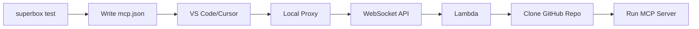

## Usage

```bash
superbox test --url URL --client CLIENT [--entrypoint FILE] [--lang LANGUAGE]
```

## Description

Test an MCP server directly from a GitHub repository URL without registry registration or security checks. Perfect for rapid development and testing before publishing to the platform.

<Warning>
  **TEST MODE** - Bypasses security scanning and S3 registration. Use only for testing your own servers during development.
</Warning>

## Options

<ParamField path="--url" type="string" required>
  GitHub repository URL of the MCP server
</ParamField>

<ParamField path="--client" type="string" required>
  Target AI client: `vscode`, `cursor`, `windsurf`, `claude`, or `chatgpt`
</ParamField>

<ParamField path="--entrypoint" type="string" default="main.py">
  Entrypoint file for the server
</ParamField>

<ParamField path="--lang" type="string" default="python">
  Programming language (currently supports Python)
</ParamField>

## How It Works

<Steps>
  <Step title="Skip Registry">
    Bypasses S3 registry lookup and security scanning pipeline
  </Step>

  <Step title="Configure Client">
    Writes MCP config with test mode WebSocket URL pointing directly to your repo
  </Step>

  <Step title="Lambda Clones Repo">
    Lambda executor clones your repo from GitHub on-demand (no S3 storage)
  </Step>

  <Step title="Test in Client">
    Use the server immediately in your AI client (appears as `your-repo-test`)
  </Step>
</Steps>

## Architecture



The test mode uses the same WebSocket infrastructure as production but tells Lambda to clone directly from your repo URL instead of fetching from S3.

## Security Notice

<Warning>
This command skips:
- Security scanning (SonarQube, Bandit, GitGuardian)
- Quality checks
- Registry validation

**Only test servers you trust or own.**
</Warning>

## Examples

<CodeGroup>
```bash Basic Test
superbox test --url https://github.com/user/my-mcp --client cursor
```

```bash Custom Entrypoint
superbox test \
  --url https://github.com/user/my-mcp \
  --client vscode \
  --entrypoint server.py
```

```bash Node.js Server
superbox test \
  --url https://github.com/user/my-mcp \
  --client claude \
  --lang node \
  --entrypoint index.js
```
</CodeGroup>

## Example Output

```bash
$ superbox test --url https://github.com/user/my-mcp --client cursor
⚠️  TEST MODE - No Security Checks
This server is being tested directly and has NOT gone through:
  • Security scanning (SonarQube, Bandit, GitGuardian)
  • Quality checks
  • Registry validation

✓ Configuration written to ~/.cursor/mcp.json

Ready to test in Cursor!
```

## Next Steps

<CardGroup cols={2}>
  <Card title="Push Server" icon="upload" href="/cli/push">
    Publish after tests pass
  </Card>
  <Card title="Run Locally" icon="play" href="/cli/run">
    Test interactively
  </Card>
</CardGroup>
