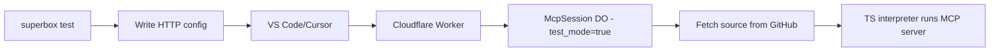

---
title: "superbox test"
description: "Test MCP server directly from repository without registry (development mode)"
icon: "flask"
---

## Usage

```bash
superbox test --url URL --client CLIENT [--entrypoint FILE]
```

## Description

Test an MCP server directly from a GitHub repository URL without registry registration or security checks. Perfect for rapid development and testing before publishing to the platform.

<Warning>
  **TEST MODE** - Bypasses security scanning and R2 registry. Use only for testing your own servers during development.
</Warning>

## Options

<ParamField path="--url" type="string" required>
  GitHub repository URL of the MCP server
</ParamField>

<ParamField path="--client" type="string" required>
  Target AI client: `vscode`, `cursor`, `antigravity`, `claude`, or `chatgpt`
</ParamField>

<ParamField path="--entrypoint" type="string" default="main.py">
  Entry point file within the repository root.
</ParamField>

## How It Works

<Steps>
  <Step title="Skip Registry">
 Bypasses R2 registry lookup and security scanning pipeline
  </Step>

  <Step title="Configure Client">
 Writes MCP config with test mode HTTP URL pointing directly to the Cloudflare Worker
  </Step>

  <Step title="Worker fetches source file">
 The Cloudflare Worker reads the entrypoint directly from the GitHub URL - no R2 registry lookup
  </Step>

  <Step title="Test in Client">
 Use the server immediately in your AI client. It appears as `{repo-name}-test` in the config (e.g. a repo named `my-mcp` becomes `my-mcp-test`).
  </Step>
</Steps>

## Architecture


```mermaid
graph LR
 A[superbox test] --> B[Write HTTP config]
 B --> C[VS Code/Cursor]
 C --> D[Cloudflare Worker]
 D --> E[McpSession DO - test_mode=true]
 E --> F[Fetch source from GitHub]
 F --> G[TS interpreter runs MCP server]
```

Test mode uses the same Worker infrastructure as production but skips the R2 registry lookup and fetches the entrypoint source directly from your GitHub URL.

## Security Notice

<Warning>
This command skips:
- Security scanning (SonarCloud, tool discovery, Snyk, GitGuardian, Bandit)
- Quality checks
- Registry validation

**Only test servers you trust or own.**
</Warning>

## Examples

<CodeGroup>
```bash Basic Test
superbox test --url https://github.com/user/my-mcp --client cursor
```

```bash Custom Entrypoint
superbox test \
  --url https://github.com/user/my-mcp \
  --client vscode \
  --entrypoint server.py
```
</CodeGroup>

## Example Output

```bash
$ superbox test --url https://github.com/user/my-mcp --client cursor
[TEST MODE] - No Security Checks
This server is being tested directly and has NOT gone through:
  - Security scanning (SonarCloud, tool discovery, Snyk, GitGuardian, Bandit)
  - Quality checks
  - Registry validation

Configuration written to ~/.cursor/mcp.json

Ready to test in Cursor!
```

## Next Steps

<CardGroup cols={2}>
  <Card title="Push Server" icon="upload" href="/cli/push">
 Publish after tests pass
  </Card>
</CardGroup>
