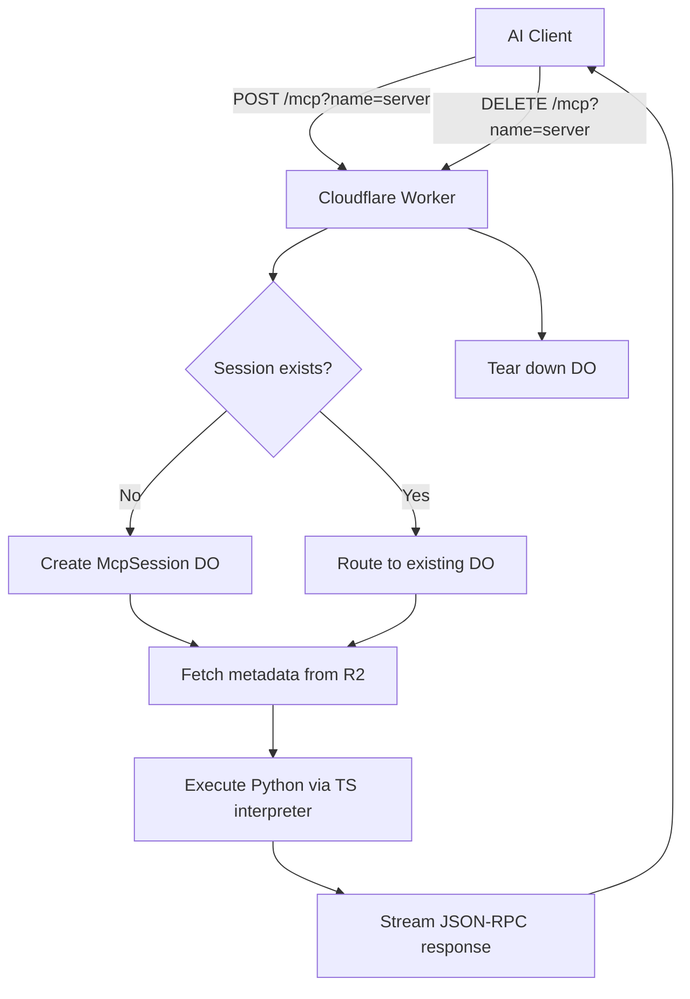

---
title: "Sandboxed Execution"
description: "How SuperBox isolates MCP server execution with Cloudflare Durable Objects"
icon: "box"
---

## Overview

SuperBox uses **Cloudflare Durable Objects** to execute MCP servers in isolated, stateful sessions. Each session runs in its own `McpSession` DO instance - completely separated from other users and servers.

<CardGroup cols={2}>
  <Card title="Session Isolation" icon="lock">
 One Durable Object per session, keyed on `Mcp-Session-Id`
  </Card>
  <Card title="No Local Proxy" icon="network-wired">
 AI clients connect directly over HTTP - no stdio proxy process needed
  </Card>
  <Card title="Auto-Eviction" icon="clock">
 Sessions idle for 30 minutes are automatically torn down
  </Card>
  <Card title="Test Mode" icon="flask">
 Run unreleased servers directly from a GitHub URL
  </Card>
</CardGroup>

## Execution Architecture



## Execution Flow

<Steps>
  <Step title="Client sends a request">
 The AI client (Cursor, VS Code, Claude Desktop, etc.) sends a `POST` request directly to the Cloudflare Worker:

 ```http
 POST https://superbox-executor.<your-subdomain>.workers.dev/mcp?name=weather-server
 Mcp-Session-Id: sess_abc123
 Content-Type: application/json
 Authorization: Bearer <firebase-jwt>

 {"jsonrpc":"2.0","method":"tools/list","id":1}
 ```

 No local proxy or `cmd:` entry is needed.
  </Step>

  <Step title="Worker routes to a Durable Object">
 The Worker looks up (or creates) a `McpSession` Durable Object for the given session ID. Each DO stores the session state in memory for its lifetime.
  </Step>

  <Step title="DO fetches server metadata">
 The DO reads `{server-name}.json` from the `superbox-mcp-registry` R2 bucket to find the entrypoint and repository URL.
  </Step>

  <Step title="TypeScript interpreter executes Python">
 The MCP server's Python entrypoint runs inside an embedded TypeScript interpreter - no subprocess, no Pyodide WASM, no `pip install`. The interpreter handles:

 - `requests`-based HTTP tool calls
 - JSON parsing and serialisation
 - Common Python control flow and string manipulation

 **Not supported:** `httpx`, `aiohttp`, `async def`, C extensions, class definitions, file I/O.
  </Step>

  <Step title="Response streams back">
 The JSON-RPC result is returned as an HTTP response. For streaming use cases, Server-Sent Events are supported.
  </Step>

  <Step title="Session teardown">
 When the AI client is done, it sends:

 ```http
 DELETE https://superbox-executor.<your-subdomain>.workers.dev/mcp?name=weather-server
 Mcp-Session-Id: sess_abc123
 ```

 The DO is destroyed immediately. Sessions that go idle for 30 minutes are evicted automatically via a Durable Object alarm.
  </Step>
</Steps>

## Test Mode

You can run an unreleased server directly from its GitHub repository without publishing it to the registry:

```http
POST https://superbox-executor.<your-subdomain>.workers.dev/mcp?name=my-server&test_mode=true&repo_url=https://github.com/user/repo&entrypoint=main.py
```

The Worker skips the R2 registry lookup and fetches the source file directly from the provided URL.

## Security Model

<CardGroup cols={2}>
  <Card title="DO isolation" icon="shield">
 Each session runs in a separate Durable Object with its own memory space. One session cannot access another's state.
  </Card>
  <Card title="No persistent filesystem" icon="hard-drive">
 The TypeScript interpreter has no access to the host filesystem. No files are written between requests.
  </Card>
  <Card title="Network via requests only" icon="globe">
 Outbound network is only possible through the `requests` library shim. Raw socket access is not available.
  </Card>
  <Card title="Short-lived sessions" icon="hourglass">
 The 30-minute idle alarm and explicit DELETE endpoint ensure sessions do not accumulate.
  </Card>
</CardGroup>

