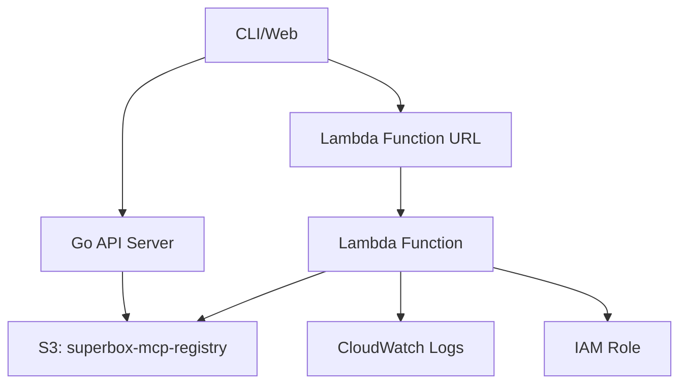

## Core Components

SuperBox uses four AWS services:

<CardGroup cols={2}>
  <Card title="S3 Bucket" icon="database">
    Registry storage - one JSON file per server
  </Card>
  <Card title="Lambda Function" icon="bolt">
    MCP executor with Python 3.11 runtime
  </Card>
  <Card title="IAM Role" icon="shield">
    Lambda execution permissions
  </Card>
  <Card title="CloudWatch Logs" icon="chart-line">
    7-day log retention
  </Card>
</CardGroup>

## Architecture



## Infrastructure Details

### S3 Bucket

**Name:** `superbox-mcp-registry`
**Region:** `ap-south-1`

**Structure:**

```
superbox-mcp-registry/
├── weather-server.json
├── file-server.json
└── ...
```

Each JSON file contains:

- Server metadata (name, version, description, author)
- Repository URL
- Entrypoint file
- Tools list
- Security report
- Pricing

### Lambda Function

**Name:** `superbox-mcp-executor`
**Runtime:** Python 3.11
**Memory:** 512 MB (default, configurable)
**Timeout:** 60 seconds (configurable up to 900)
**Handler:** `lambda.lambda_handler`

**Function URL:** Public HTTPS endpoint

- CORS enabled for web clients
- No authentication required
- Format: `https://{url}/{server-name}`

**Environment Variables:**

- `AWS_REGION` - Deployment region
- `S3_BUCKET` - Registry bucket name

**Execution:**

1. Receive HTTP POST with server name
2. Fetch `{name}.json` from S3
3. Download GitHub repo as ZIP
4. Extract to `/tmp`
5. Install dependencies (`pip install`)
6. Run entrypoint with request body
7. Return JSON-RPC response

### IAM Role

**Permissions:**

- `s3:GetObject` - Read from registry
- `logs:CreateLogGroup` - CloudWatch setup
- `logs:CreateLogStream` - Log streaming
- `logs:PutLogEvents` - Write logs

**Trust:** Lambda service

### CloudWatch Logs

**Log Group:** `/aws/lambda/superbox-mcp-executor`
**Retention:** 7 days
**Content:** Execution logs, errors, debug info

## Infrastructure as Code

<Tabs>
  <Tab title="Module Structure">
    ```
    SuperBox-Infra/
    ├── main.tf              # Root configuration
    ├── variables.tf         # Input variables
    ├── outputs.tf           # Output values
    ├── providers.tf         # AWS provider config
    ├── terraform.tfvars     # Variable values (gitignored)
    └── modules/
        ├── s3/              # S3 bucket module
        │   ├── main.tf
        │   ├── variables.tf
        │   └── outputs.tf
        ├── lambda/          # Lambda function module
        │   ├── main.tf
        │   ├── variables.tf
        │   └── outputs.tf
        └── iam/             # IAM roles module
            ├── main.tf
            ├── variables.tf
            └── outputs.tf
    ```
  </Tab>
  
  <Tab title="Key Variables">
    ```hcl
    variable "project_name" {
      description = "Project name prefix for resources"
      type        = string
      default     = "superbox"
    }
    
    variable "aws_region" {
      description = "AWS region for deployment"
      type        = string
      default     = "ap-south-1"
    }
    
    variable "lambda_memory_size" {
      description = "Lambda memory in MB"
      type        = number
      default     = 2048
    }
    
    variable "lambda_timeout" {
      description = "Lambda timeout in seconds"
      type        = number
      default     = 900
    }
    ```
  </Tab>
  
  <Tab title="Outputs">
    ```hcl
    output "s3_bucket_name" {
      description = "MCP registry S3 bucket name"
      value       = module.s3.bucket_name
    }
    
    output "lambda_function_url" {
      description = "Lambda function URL for MCP execution"
      value       = module.lambda.function_url
    }
    
    output "lambda_function_arn" {
      description = "Lambda function ARN"
      value       = module.lambda.function_arn
    }
    ```
  </Tab>
</Tabs>

## Cost Optimization

<CardGroup cols={2}>
  <Card title="S3 Costs" icon="indian-rupee-sign">
    - **Storage:** ~₹2/GB/month - **Requests:** Minimal (read-heavy) -
    **Transfer:** Free within AWS **Estimated:** ₹80-400/month
  </Card>

<Card title="Lambda Costs" icon="indian-rupee-sign">
  - **Invocations:** First 1M free/month - **Duration:** ₹0.0014/GB-second -
  **Requests:** ₹16 per 1M requests **Estimated:** ₹800-4000/month (based on
  traffic)
</Card>

<Card title="CloudWatch Costs" icon="indian-rupee-sign">
  - **Ingestion:** First 5GB free/month - **Storage:** ₹40/GB/month -
  **Retention:** 7 days (minimal storage) **Estimated:** ₹0-160/month
</Card>

  <Card title="Total Monthly Cost" icon="indian-rupee-sign">
    **Small Scale:** ₹880-4560/month **Medium Scale:** ₹4000-16000/month **Enterprise
    Scale:** Custom pricing
  </Card>
</CardGroup>

## Security Best Practices

<Steps>
  <Step title="IAM Least Privilege">
    Lambda execution role has only necessary S3 read and CloudWatch write
    permissions. No write access to S3 or other AWS services.
  </Step>

<Step title="VPC Isolation">
  Lambda functions can be deployed in VPC for network isolation. MCP servers
  cannot access internal AWS resources.
</Step>

<Step title="Encryption at Rest">
  S3 bucket uses AES-256 server-side encryption. CloudWatch logs are encrypted
  by default.
</Step>

<Step title="HTTPS Only">
  Lambda Function URL enforces HTTPS. No plain HTTP traffic allowed.
</Step>

  <Step title="CloudWatch Monitoring">
    All Lambda invocations logged. Failed executions trigger alerts. Anomaly
    detection enabled.
  </Step>
</Steps>

## Next Steps

<CardGroup cols={2}>
  <Card title="Setup Guide" icon="wrench" href="/infrastructure/setup">
    Deploy infrastructure with OpenTofu
  </Card>
  <Card title="Monitoring" icon="chart-line" href="/infrastructure/monitoring">
    Set up CloudWatch dashboards
  </Card>
  <Card
    title="Scaling"
    icon="up-right-and-down-left-from-center"
    href="/infrastructure/scaling"
  >
    Configure auto-scaling policies
  </Card>
  <Card
    title="Troubleshooting"
    icon="screwdriver-wrench"
    href="/infrastructure/troubleshooting"
  >
    Debug common infrastructure issues
  </Card>
</CardGroup>
