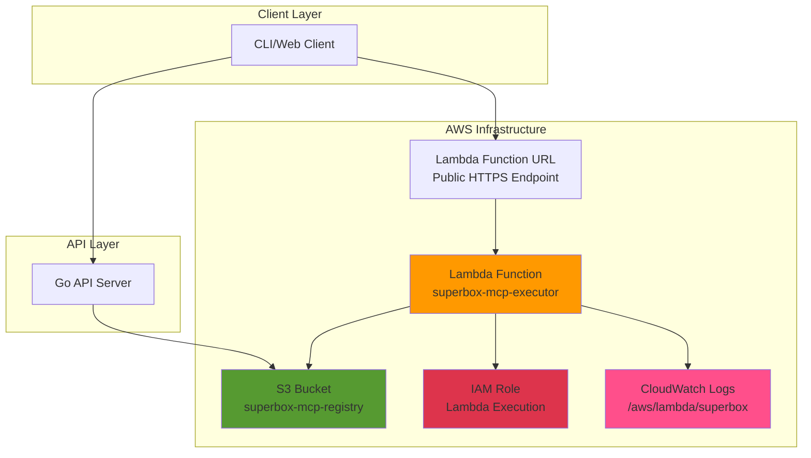

SuperBox infrastructure is deployed on AWS using **Infrastructure as Code (IaC)** with OpenTofu/Terraform. The architecture provides scalable, secure, and cost-effective MCP server execution.

## Core Components

<CardGroup cols={2}>
  <Card title="S3 Registry" icon="database" color="#569A31">
    MCP server metadata storage with per-file JSON structure
  </Card>
  <Card title="Lambda Executor" icon="bolt" color="#FF9900">
    Sandboxed MCP server execution with 15-min timeout
  </Card>
  <Card title="IAM Roles" icon="shield" color="#DD344C">
    Least-privilege access with Lambda execution policies
  </Card>
  <Card title="CloudWatch Logs" icon="chart-line" color="#FF4F8B">
    Centralized logging with 7-day retention
  </Card>
</CardGroup>

## Architecture Diagram



## Infrastructure Modules

<Accordion title="S3 Module">
**Purpose:** MCP server registry storage

**Resources:**

- S3 bucket with versioning enabled
- Bucket policy for public read access
- Server-side encryption (AES-256)
- Lifecycle policies for cost optimization

**File Structure:**

```
superbox-mcp-registry/
├── server-1.json
├── server-2.json
├── server-3.json
└── ...
```

Each JSON file contains complete server metadata including repository URL, entrypoint, tools, security reports, and pricing information.

</Accordion>

<Accordion title="Lambda Module">
**Purpose:** Sandboxed MCP server execution

**Configuration:**

- **Runtime:** Python 3.11
- **Memory:** 2048 MB (configurable up to 10GB)
- **Timeout:** 900 seconds (15 minutes)
- **Handler:** `lambda.lambda_handler`
- **Environment:** S3 bucket name, AWS region

**Features:**

- Function URL for direct HTTPS invocation
- CORS enabled for web client access
- VPC isolation for enhanced security
- Automatic scaling and load balancing

**Execution Flow:**

1. Receive HTTP request with MCP server name
2. Fetch metadata from S3
3. Download repository from GitHub as ZIP
4. Install Python/npm dependencies
5. Execute MCP server with request payload
6. Return JSON response
   </Accordion>

<Accordion title="IAM Module">
**Purpose:** Secure access control with least privilege

**Lambda Execution Role Permissions:**

- `s3:GetObject` - Read server metadata from S3
- `s3:ListBucket` - List available servers
- `logs:CreateLogGroup` - Create CloudWatch log groups
- `logs:CreateLogStream` - Create log streams
- `logs:PutLogEvents` - Write execution logs

**Trust Policy:**

```json
{
  "Version": "2012-10-17",
  "Statement": [
    {
      "Effect": "Allow",
      "Principal": {
        "Service": "lambda.amazonaws.com"
      },
      "Action": "sts:AssumeRole"
    }
  ]
}
```

</Accordion>

<Accordion title="CloudWatch Logs">
**Purpose:** Centralized logging and monitoring

**Configuration:**

- Log group: `/aws/lambda/superbox-mcp-executor`
- Retention: 7 days (cost-optimized)
- Log streams created per Lambda invocation

**Logged Information:**

- MCP server name and metadata
- Repository clone operations
- Dependency installation output
- Server execution logs
- Error traces and stack traces
  </Accordion>

## Infrastructure as Code

<Tabs>
  <Tab title="Module Structure">
    ```
    SuperBox-Infra/
    ├── main.tf              # Root configuration
    ├── variables.tf         # Input variables
    ├── outputs.tf           # Output values
    ├── providers.tf         # AWS provider config
    ├── terraform.tfvars     # Variable values (gitignored)
    └── modules/
        ├── s3/              # S3 bucket module
        │   ├── main.tf
        │   ├── variables.tf
        │   └── outputs.tf
        ├── lambda/          # Lambda function module
        │   ├── main.tf
        │   ├── variables.tf
        │   └── outputs.tf
        └── iam/             # IAM roles module
            ├── main.tf
            ├── variables.tf
            └── outputs.tf
    ```
  </Tab>
  
  <Tab title="Key Variables">
    ```hcl
    variable "project_name" {
      description = "Project name prefix for resources"
      type        = string
      default     = "superbox"
    }
    
    variable "aws_region" {
      description = "AWS region for deployment"
      type        = string
      default     = "ap-south-1"
    }
    
    variable "lambda_memory_size" {
      description = "Lambda memory in MB"
      type        = number
      default     = 2048
    }
    
    variable "lambda_timeout" {
      description = "Lambda timeout in seconds"
      type        = number
      default     = 900
    }
    ```
  </Tab>
  
  <Tab title="Outputs">
    ```hcl
    output "s3_bucket_name" {
      description = "MCP registry S3 bucket name"
      value       = module.s3.bucket_name
    }
    
    output "lambda_function_url" {
      description = "Lambda function URL for MCP execution"
      value       = module.lambda.function_url
    }
    
    output "lambda_function_arn" {
      description = "Lambda function ARN"
      value       = module.lambda.function_arn
    }
    ```
  </Tab>
</Tabs>

## Cost Optimization

<CardGroup cols={2}>
  <Card title="S3 Costs" icon="dollar">
    - **Storage:** ~$0.023/GB/month - **Requests:** Minimal (read-heavy) -
    **Transfer:** Free within AWS **Estimated:** $1-5/month
  </Card>

  <Card title="Lambda Costs" icon="dollar">
    - **Invocations:** First 1M free/month - **Duration:**
    $0.0000166667/GB-second - **Requests:** $0.20 per 1M requests **Estimated:**
    $10-50/month (based on traffic)
  </Card>

  <Card title="CloudWatch Costs" icon="dollar">
    - **Ingestion:** First 5GB free/month - **Storage:** $0.50/GB/month -
    **Retention:** 7 days (minimal storage) **Estimated:** $0-2/month
  </Card>

  <Card title="Total Monthly Cost" icon="dollar">
    **Small Scale:** $11-57/month **Medium Scale:** $50-200/month **Enterprise
    Scale:** Custom pricing
  </Card>
</CardGroup>

## Security Best Practices

<Steps>
  <Step title="IAM Least Privilege">
    Lambda execution role has only necessary S3 read and CloudWatch write
    permissions. No write access to S3 or other AWS services.
  </Step>

  <Step title="VPC Isolation">
    Lambda functions can be deployed in VPC for network isolation. MCP servers
    cannot access internal AWS resources.
  </Step>

  <Step title="Encryption at Rest">
    S3 bucket uses AES-256 server-side encryption. CloudWatch logs are encrypted
    by default.
  </Step>

  <Step title="HTTPS Only">
    Lambda Function URL enforces HTTPS. No plain HTTP traffic allowed.
  </Step>

  <Step title="CloudWatch Monitoring">
    All Lambda invocations logged. Failed executions trigger alerts. Anomaly
    detection enabled.
  </Step>
</Steps>

## Next Steps

<CardGroup cols={2}>
  <Card title="Setup Guide" icon="wrench" href="/infrastructure/setup">
    Deploy infrastructure with OpenTofu
  </Card>
  <Card title="Monitoring" icon="chart-line" href="/infrastructure/monitoring">
    Set up CloudWatch dashboards
  </Card>
  <Card
    title="Scaling"
    icon="up-right-and-down-left-from-center"
    href="/infrastructure/scaling"
  >
    Configure auto-scaling policies
  </Card>
  <Card
    title="Troubleshooting"
    icon="screwdriver-wrench"
    href="/infrastructure/troubleshooting"
  >
    Debug common infrastructure issues
  </Card>
</CardGroup>
