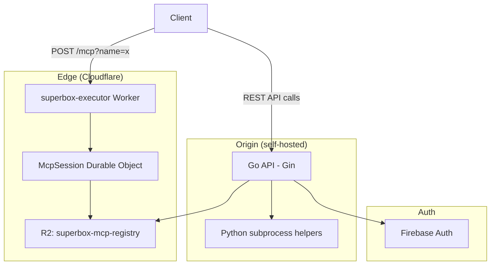

---
title: "Infrastructure Overview"
description: "SuperBox infrastructure built on Cloudflare Workers, R2, and Durable Objects"
icon: "cloud"
---

## Architecture summary

SuperBox execution runs entirely on Cloudflare's developer platform (Worker + Durable Objects + R2). The Go API origin is a separate self-hosted service managed via Docker. Cloudflare resources are provisioned with Terraform (config in `/infra`).

<CardGroup cols={2}>
  <Card title="Cloudflare Worker" icon="bolt">
 Edge compute that routes MCP requests to the correct Durable Object
  </Card>
  <Card title="McpSession Durable Object" icon="cube">
 Stateful session runtime - one instance per client session
  </Card>
  <Card title="Cloudflare R2" icon="database">
 Object storage for server metadata (S3-compatible API)
  </Card>
  <Card title="Firebase Auth" icon="key">
 JWT-based authentication for the Go API and the Worker
  </Card>
</CardGroup>

## Component map

```mermaid
graph TB
 subgraph "Edge (Cloudflare)"
  W[superbox-executor Worker]
  DO[McpSession Durable Object]
  R2[R2: superbox-mcp-registry]
 end

 subgraph "Origin (self-hosted)"
  GO[Go API - Gin]
  PY[Python subprocess helpers]
 end

 subgraph "Auth"
  FB[Firebase Auth]
 end

 Client -->|POST /mcp?name=x| W
 W --> DO
 DO --> R2
 Client -->|REST API calls| GO
 GO --> PY
 GO --> FB
 GO --> R2
```

## Cloudflare Worker

The Worker (`superbox-executor`) is the MCP execution endpoint. All AI client traffic goes through it.

| Property | Value |
|----------|-------|
| Name | `superbox-executor` |
| URL | `https://superbox-executor.<your-subdomain>.workers.dev/mcp` |
| Protocol | MCP Streamable HTTP (rev 2025-11-25) |
| Methods | `POST` (invoke), `DELETE` (teardown) |
| Auth | Firebase JWT in `Authorization: Bearer` header |

## Durable Objects

`McpSession` is the stateful session class. One instance per `Mcp-Session-Id`.

| Property | Value |
|----------|-------|
| Class | `McpSession` |
| Session key | `Mcp-Session-Id` request header |
| Idle eviction | 30-minute alarm |
| Storage | In-memory only (no DO storage API used) |

## Cloudflare R2

R2 stores server metadata. The Go API writes to it via a Python subprocess (`s3_helper.py`) using the S3-compatible boto3 endpoint.

| Property | Value |
|----------|-------|
| Bucket name | `superbox-mcp-registry` |
| Object key | `{server-name}.json` |
| Access | S3-compatible (`CLOUDFLARE_R2_ENDPOINT`, `CLOUDFLARE_R2_ACCESS_KEY_ID`, `CLOUDFLARE_R2_SECRET_ACCESS_KEY`) |

## Go API (backend)

The Go API (Gin, 1.26) handles server CRUD and security scanning. It runs as a Docker container.

| Property | Value |
|----------|-------|
| Framework | Gin |
| Go version | 1.26 |
| Auth | Firebase JWT middleware |
| R2 access | Python subprocess (`s3_helper.py`) |
| Security scan | Python subprocess (`security_helper.py`) |

## Deployment summary

| Component | Deploy command |
|-----------|---------------|
| Cloudflare Worker + DO | `npx wrangler deploy` (from `cloudflare/`) |
| Go API | `docker build && docker run` |
| R2 bucket (one-time) | `wrangler r2 bucket create superbox-mcp-registry` |
