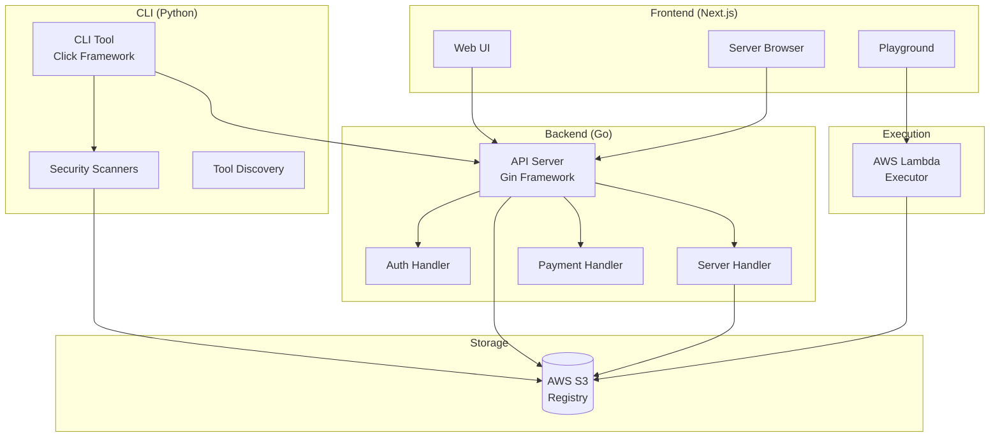

## What is SuperBox?

SuperBox is a comprehensive platform for discovering, deploying, and testing Model Context Protocol (MCP) servers in isolated sandboxes. Built with modern technologies, SuperBox provides a secure and efficient way to manage your MCP infrastructure with S3-backed registry, AWS Lambda execution, and comprehensive security scanning.

<CardGroup cols={2}>
  <Card
    title="Discover Servers"
    icon="magnifying-glass"
    href="/api/servers/list"
  >
    Browse and explore a curated collection of MCP servers from the community
  </Card>
  <Card
    title="Sandboxed Execution"
    icon="shield-halved"
    href="/architecture"
  >
    Execute MCP servers in isolated AWS Lambda environments
  </Card>
  <Card
    title="Security Pipeline"
    icon="shield-check"
    href="/concepts/security"
  >
    Comprehensive security checks with SonarCloud, Bandit, and GitGuardian
  </Card>
  <Card
    title="One-Click Deploy"
    icon="rocket"
    href="/api/servers/create"
  >
    Deploy your MCP servers instantly with our powerful API
  </Card>
</CardGroup>

## Why SuperBox?

<AccordionGroup>
  <Accordion title="No Centralized MCP Registry">
    Currently, there's no central place to discover all MCP servers. SuperBox provides a unified registry where developers can publish and users can discover MCP servers with confidence.
  </Accordion>

  <Accordion title="Security & Quality Assurance">
    All MCPs on SuperBox pass a comprehensive 5-step security and quality check (SonarQube, Bandit, GitGuardian) to reduce vulnerabilities and promote best practices.
  </Accordion>

  <Accordion title="Sandboxed Execution">
    Unlike MCPs that run locally on your machine, MCP servers on SuperBox execute in isolated sandbox environments and return responses securely via AWS Lambda.
  </Accordion>

  <Accordion title="Documentation Gap">
    Many MCPs lack clear usage documentation. SuperBox auto-generates documentation from your code and provides interactive examples.
  </Accordion>
</AccordionGroup>

## Platform Components

### 🖥️ Frontend (Next.js)

Modern, responsive web application built with:
- **Framework**: Next.js 16 with React 19
- **Styling**: Tailwind CSS 4.1 with custom animations
- **UI**: Framer Motion for smooth animations
- **Icons**: Lucide React icon library

[Learn more about the Frontend →](/frontend/overview)

### ⚙️ Backend (Go + Python)

High-performance backend with:
- **API Server**: Golang with Gin framework
- **CLI**: Python with Click framework  
- **Storage**: AWS S3 for registry
- **Executor**: AWS Lambda for sandboxed execution
- **Security**: SonarCloud, Bandit, GitGuardian

[Learn more about the Backend →](/backend/overview)

### 🔧 CLI Tool

Powerful command-line interface to:
- Initialize new MCP servers
- Run security scans
- Push to registry
- Auto-configure AI clients
- Test servers interactively

[Learn more about the CLI →](/cli/introduction)

## Key Features

<Steps>
  <Step title="Discover">
    Browse the central registry to find MCP servers for your needs. Filter by language, category, security score, and more.
  </Step>
  <Step title="Deploy">
    Deploy MCP servers to isolated sandboxes with one command. No infrastructure setup required.
  </Step>
  <Step title="Test">
    Test MCP servers interactively in the playground or via CLI before integrating into your applications.
  </Step>
  <Step title="Integrate">
    Auto-configure your AI clients (VS Code, Cursor, Claude, ChatGPT) to use MCP servers from SuperBox.
  </Step>
</Steps>

## Quick Start

Get started with SuperBox in minutes:

<CodeGroup>

```bash CLI
# Install the CLI
pip install superbox

# Initialize a new MCP server
superbox init

# Push to registry (with security scan)
superbox push

# Configure your AI client
superbox pull my-server --client cursor
```

```bash API
# List all servers
curl https://api.superbox.ai/api/v1/servers

# Get a specific server
curl https://api.superbox.ai/api/v1/servers/weather-mcp

# Create a new server
curl -X POST https://api.superbox.ai/api/v1/servers \
  -H "Content-Type: application/json" \
  -d '{"name": "my-server", ...}'
```

```javascript Frontend
// Browse servers
const servers = await fetch('/api/servers')
  .then(r => r.json());

// Deploy to sandbox
const deployment = await deployServer(serverId);

// Test in playground
testServer(deployment.url);
```

</CodeGroup>

## Architecture Overview



## Use Cases

<CardGroup cols={2}>
  <Card title="MCP Developers" icon="code">
    Publish your MCP servers to a central registry with automatic security scanning and documentation.
  </Card>
  <Card title="AI Application Builders" icon="robot">
    Discover and integrate vetted MCP servers into your AI applications without infrastructure overhead.
  </Card>
  <Card title="Enterprise Teams" icon="building">
    Deploy private MCP servers with enterprise security and compliance features.
  </Card>
  <Card title="Researchers" icon="flask">
    Experiment with MCP servers in isolated sandboxes before production deployment.
  </Card>
</CardGroup>

## Technology Stack

### Frontend
- Next.js 16 (App Router)
- React 19
- TypeScript 5
- Tailwind CSS 4.1
- Framer Motion
- Lucide Icons

### Backend
- **API**: Go 1.21+ with Gin
- **CLI**: Python 3.11+ with Click
- **Storage**: AWS S3
- **Execution**: AWS Lambda
- **Auth**: Firebase Authentication
- **Payment**: Razorpay

### Security
- SonarCloud (code quality)
- Bandit (Python security)
- GitGuardian (secrets scanning)
- Custom tool discovery

## Next Steps

<CardGroup cols={3}>
  <Card
    title="Quickstart"
    icon="rocket"
    href="/quickstart"
  >
    Get up and running in 5 minutes
  </Card>
  <Card
    title="API Reference"
    icon="book"
    href="/api/introduction"
  >
    Explore the REST API
  </Card>
  <Card
    title="CLI Reference"
    icon="terminal"
    href="/cli/introduction"
  >
    Learn CLI commands
  </Card>
  <Card
    title="Architecture"
    icon="sitemap"
    href="/architecture"
  >
    Understand the system design
  </Card>
  <Card
    title="Frontend Guide"
    icon="browser"
    href="/frontend/overview"
  >
    Build with the frontend
  </Card>
  <Card
    title="Backend Guide"
    icon="server"
    href="/backend/overview"
  >
    Deploy the backend
  </Card>
</CardGroup>

## Community & Support

<CardGroup cols={3}>
  <Card
    title="GitHub"
    icon="github"
    href="https://github.com/areebahmeddd/superbox.ai"
  >
    Star us on GitHub
  </Card>
  <Card
    title="Discord"
    icon="discord"
    href="#"
  >
    Join our community
  </Card>
  <Card
    title="Email"
    icon="envelope"
    href="mailto:hi@areeb.dev"
  >
    Get in touch
  </Card>
</CardGroup>

<Note>
  SuperBox is under active development. Features and APIs may change. Join our community to stay updated!
</Note>
